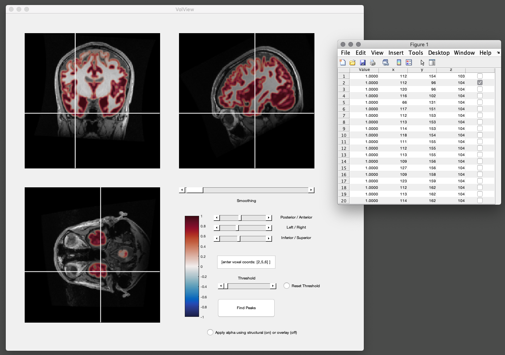

# VolView

Matlab 3D volume slice viewer, designed for overlaying functional volumetric data on structural MRIs.

Syntax:
> VolView(S,O)

S = a 3D double, (structural image) 
O = a 3D double, (the functional volume to overlay). 

size(S) == size(O)

Example showing strucutral MRI (grayscale) with grey matter segmentation overlaid as the 'functional' part.

